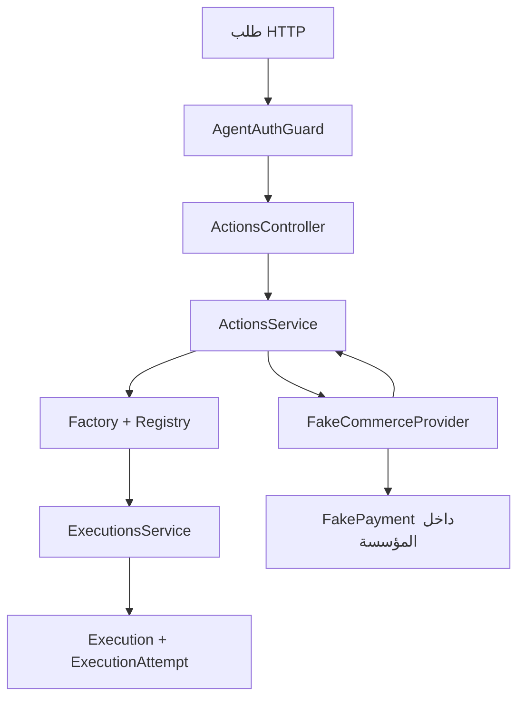
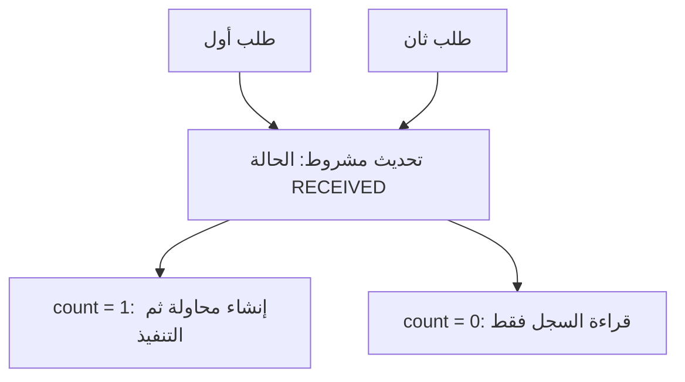

# شرح Phase B

الهدف: Agent موثوق يرسل عملية وهمية، نسجل الطلب والمحاولة، ننفذ داخل Fake Commerce، ثم نسجل النتيجة.

## الرسم المعماري

## المشكلة والحل البسيط

استدعاء المزوّد مباشرة ثم حفظ النتيجة يبدو كافيًا، لكنه يكرر الأثر عند إعادة الطلب،
ويفقد دليل المحاولة لو التطبيق توقف بعد التنفيذ. لذلك نحفظ الطلب أولًا، ثم نثبت أن
عاملًا واحدًا فقط بدأه، ثم نتعامل مع النتيجة بما نعرفه فعلًا.

## مسؤولية كل ملف

| الملف | المسؤولية |
| --- | --- |
| actions.controller.ts | قراءة HTTP وربطه بالخدمات وإرجاع النتيجة |
| actions.service.ts | تنسيق بناء الطلب والحفظ والتنفيذ وتسجيل النتيجة |
| action-request.factory.ts | دمج هوية المصادقة مع المدخلات المفحوصة وسياق السيرفر |
| executions.service.ts | الاستلام، حجز التنفيذ، إنهاؤه وقراءته بنطاق المؤسسة والـAgent |
| action-json.ts | التأكد من JSON وحساب بصمة ثابتة لمقارنة إعادة الطلب |
| fake-commerce.provider.ts | محاكاة أثر تجاري على دفعة يملكها نفس الـtenant |
| actions.module.ts | تعريف الربط والاعتمادات لـNest |

## لماذا فصلنا التنفيذ عن المحاولة؟

Execution يصف الطلب وحالته، وExecutionAttempt يسجل بدء الاتصال ونتيجته وهوية المفتاح.
النسخة الحالية تسمح بمحاولة واحدة لكل تنفيذ. هذا قيد مقصود؛ المحاولات المتعددة
وتسوية النتيجة المجهولة ستحتاج تصميمًا إضافيًا في Phase E.

## منع التنافس

داخل transaction واحدة نغير الحالة إلى EXECUTING وننشئ المحاولة.
لو إنشاء المحاولة فشل، يتراجع تغيير الحالة أيضًا. لا نترك transaction مفتوحة
طوال استدعاء المزوّد.

## شرح الـsyntax المهمة

- `@Injectable()`: يجعل الخدمة قابلة للإنشاء والحقن عبر Nest.
- `private readonly` داخل constructor: ينشئ خاصية ويحفظ الاعتماد ويمنع إعادة إسناده عبر TypeScript.
- `@UseGuards(AgentAuthGuard)`: تشغيل مصادقة الـAgent قبل دوال الـController.
- `@Headers('idempotency-key')`: استخراج قيمة الهيدر؛ بعدها نفحص طولها وصيغتها.
- `updateMany({ where, data })`: نستخدم شرط الحالة مع الهوية في نفس تحديث SQL، ونفحص count.
- `$transaction(async tx => ...)`: كل أوامر tx تنجح معًا أو تتراجع معًا.
- `...scope`: نشر حقول المؤسسة والـAgent التي اشتققناها من مصادر موثوقة.
- `outcome.status === 'SUCCEEDED'`: يضيّق نوع union، فيسمح بقراءة result الخاصة بالنجاح.
- `select`: قائمة صريحة للحقول التي يجوز إرجاعها، فلا يتسرب hash الطلب أو بيانات المفتاح.
- `instanceof ... && code === 'P2002'`: معالجة تعارض uniqueness فقط، مع إبقاء أعطال قاعدة البيانات أخطاء حقيقية.
- `z.json()`: يرفض قيمًا مثل undefined وNaN بدل فقدها بصمت أثناء التحويل إلى JSON.
- ترتيب مفاتيح JSON قبل SHA-256 يجعل اختلاف ترتيب الحقول لا يغيّر مقارنة الطلب.

## الفرق بين مفتاح إعادة الطلب وتكرار الـRefund

Idempotency-Key يحدد طلبًا واحدًا داخل نطاق المؤسسة والـAgent.
نفس المفتاح ونفس البيانات يعيدان السجل. نفس المفتاح مع بيانات مختلفة ينتج 409.
requestedAt لا يدخل في البصمة لأن وقت إعادة الإرسال يتغير.

أما إرسال مفتاحين مختلفين لنفس الدفعة، فيتعامل معه FakePayment:
التحديث يشترط refunded=false، لذلك يحدث أثر وهمي واحد فقط.
هذه قاعدة المختبر الذي يسمح باسترداد واحد لكل دفعة، وليست قاعدة عامة لكل أنواع الـActions.

## النتيجة المجهولة

لو الأثر حصل ثم الرد ضاع، نسجل OUTCOME_UNKNOWN. لا نعيد التنفيذ تلقائيًا.
ولو حفظ النتيجة في قاعدة البيانات فشل بعد الأثر، قد يبقى السجل EXECUTING ومحاولته
بلا finishedAt. إعادة الطلب تقرأ السجل ولا تعيد إرسال العملية.
لسه محتاجين تسوية ومراقبة لهذه الحالات في مرحلة التنفيذ الآمن، ومفيش ادعاء exactly-once خارجي.

## حدود الثقة

العميل يرسل اسم العملية ومدخلاتها فقط. المؤسسة والـAgent من المصادقة،
والبيئة وسيناريو المحاكاة من إعداد السيرفر. الدفعة تُنشأ بسكربت المشغّل،
ويبحث المزوّد عنها باستخدام المؤسسة ومعرّف الدفعة معًا.

التنفيذ الوهمي مغلق افتراضيًا وممنوع في production. دي حدود المختبر،
ولسه مفيش Policy Engine يسمح بعمليات حقيقية.

## ماذا تثبت الاختبارات؟

الاختبارات تغطي شكل الطلب، منع تغيير حقول الثقة، ثبات بصمة إعادة الطلب،
عزل المؤسسات والـAgents، طلبات مكررة ومتزامنة، مفتاح ملغى أو Agent معلّق،
فشل المزوّد والنتيجة المجهولة، وفشل حفظ النتيجة بعد الأثر.

اختبارات الدمج هنا نجحت على PostgreSQL مضمّن باتصال واحد؛ اختبار أقفال PostgreSQL
متعدد الاتصالات يحتاج التشغيل على Docker عندك. التفاصيل في verification.md.

راجع phase-b-guide.md لأوامر التشغيل والـmigration وتجربة Postman.
